# Review screenshots

Captured 2026-09-18 from the **live beta record** by `scripts/screenshots.js`.
Review aids for CGPT and Shaun, not release documentation. Regenerate rather than edit.

Taken from the live record on purpose: the three board decisions of 18 Sep moved most of the club,
so a capture of the seeded fixture would show ratings that no longer exist.

### Power Rankings — all time

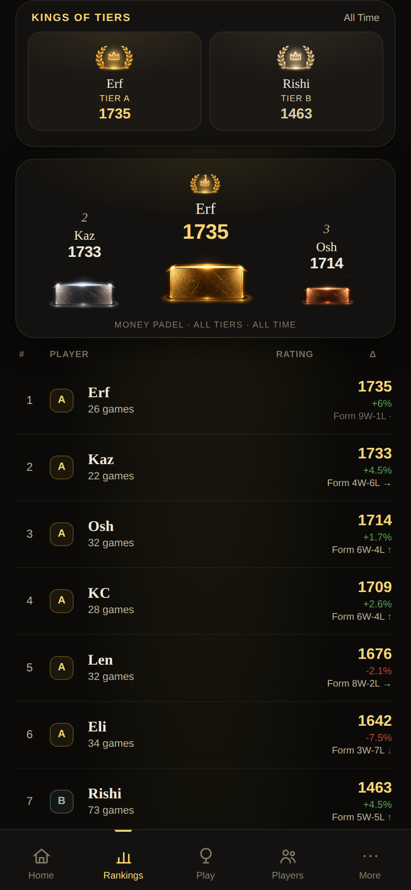

Kings of Tiers, the podium and the ranking list. A tier is crowned only where someone qualifies at the chosen minimum games, so S and C are absent here rather than shown empty.

### Power Rankings — a single month

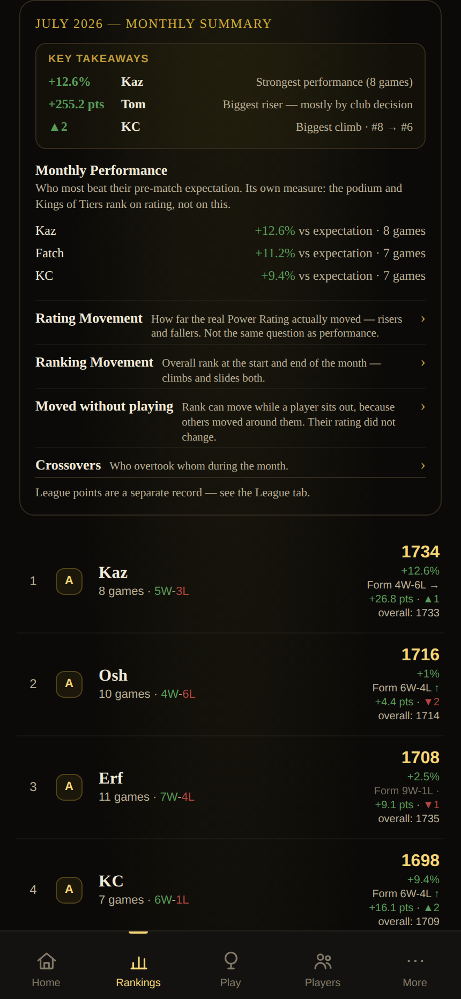

Key takeaways first, Monthly Performance open, the other three stories folded -- all four concepts kept. Club-decision movement stays labelled apart from movement earned on court, so Tom's July reads as a board decision rather than form.

### Player profile — reliability at a glance

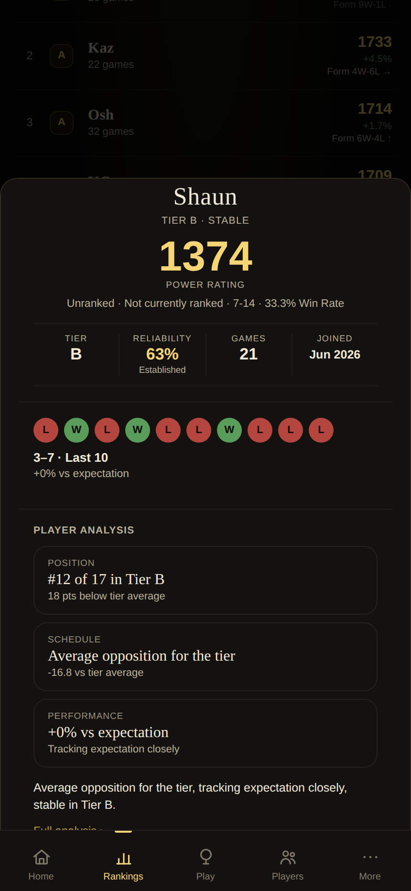

Reliability sits in its own facts row with its band, beside tier and games played and deliberately away from rank and win rate: it measures how much evidence stands behind the rating, not how good the player is.

### Rating Journey

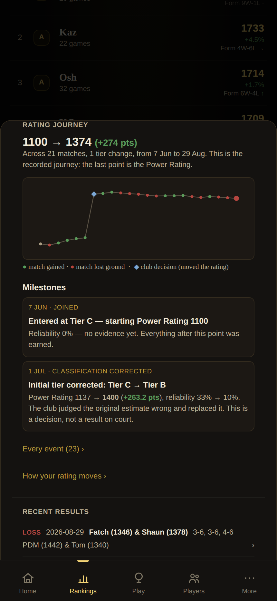

The recorded journey, not a reconstruction: the last point IS the Power Rating. Milestones show the club decision with its own marker.

### Match detail

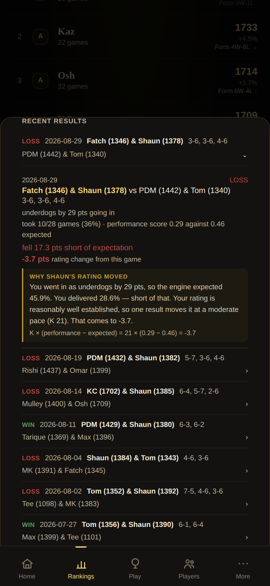

Ratings as they were going in, the performance score against the pre-match expectation, and each player's own rating change. Scores read from the player in focus, so a loss looks like a loss.

### Monthly Rating breakdown

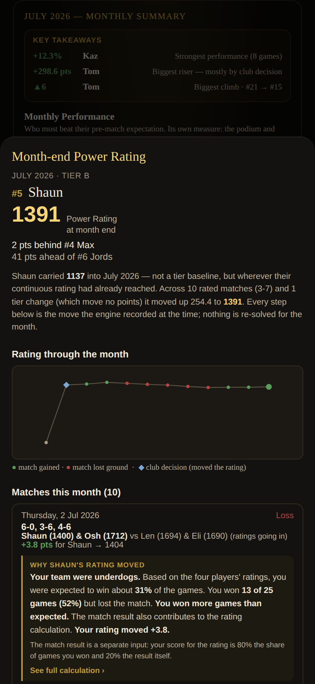

Carried-in rating (1137 -- wherever the continuous rating had reached, never a tier baseline) and the month's moves as the engine recorded them, including each player's own change in a shared match.

### Admin — Monthly Review

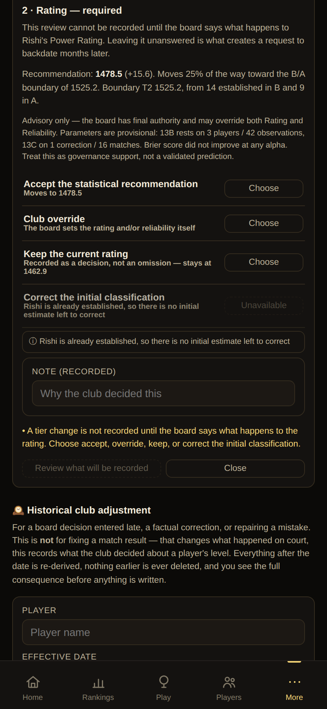

A tier change cannot be recorded until the board answers the rating question. Four explicit answers, and an answer the record makes impossible is disabled with its reason beside it rather than offered as a live button.

### Admin — Historical Club Adjustment

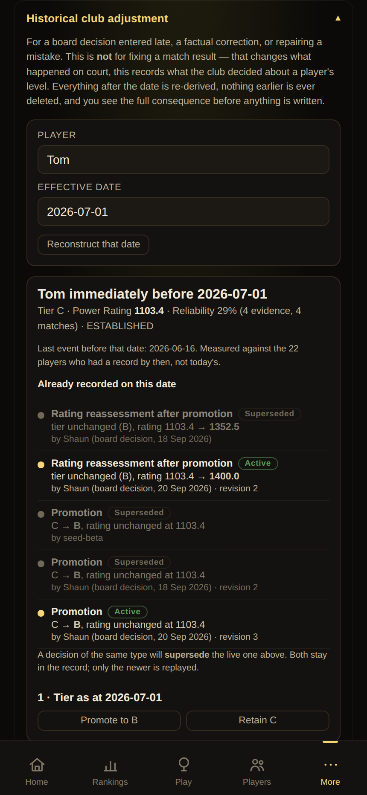

A board decision entered late. State reconstructed as at that date, and the decisions already on it labelled: what is Active, what was Superseded, and what each one actually did. Nothing earlier is deleted or rewritten.

### Admin — Beta diagnostics

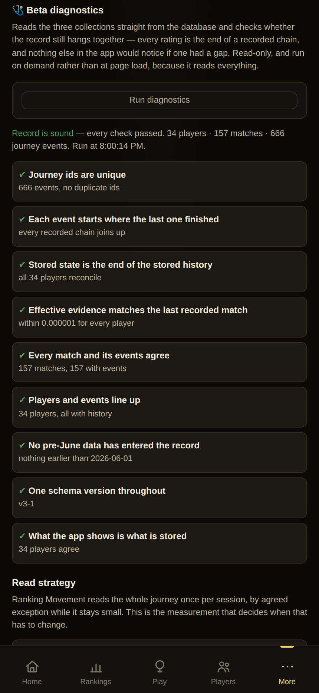

Reads the three collections directly and checks the record still hangs together. Also carries the read-strategy measurement.

### Games — historical match correction

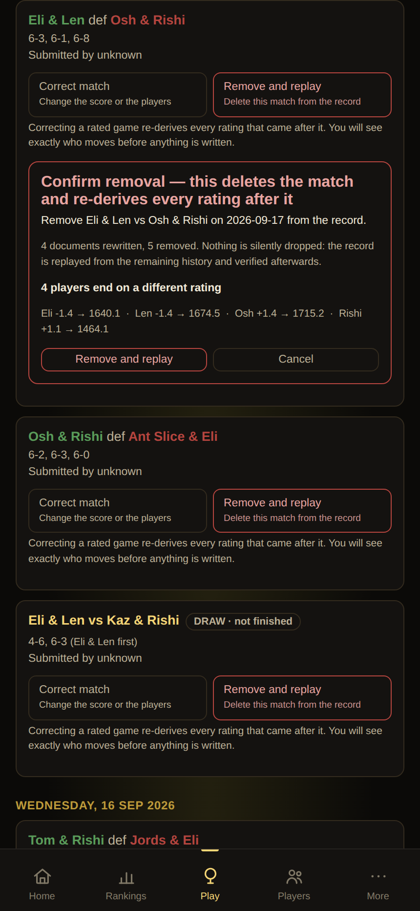

Two separate actions with their own words. A removal is confirmed by a button that says Remove and replay, never by one that says correct. The blast radius is measured by replaying and shown in full before anything is written.

### The full calculation

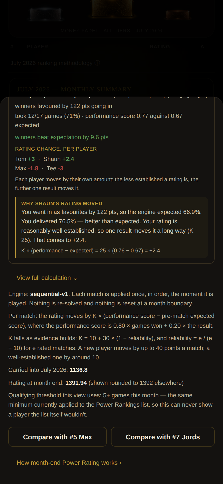

The disclosure inside the monthly breakdown: sequential-v1 stated as it actually is -- applied once in order, never re-solved, never reset at a month boundary, with K falling as evidence builds. It also shows the unrounded month-end figure.

### Power Rating Guide — in short

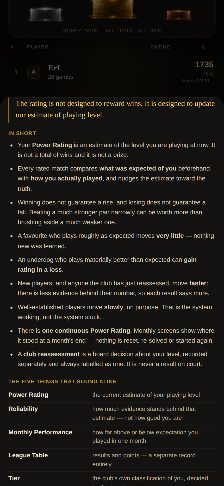

Reachable from More. Leads with the idea, not the formula: the rating is not a reward for wins, it is an estimate of level. The five things that sound alike are separated explicitly.

### Power Rating Guide — the actual calculation

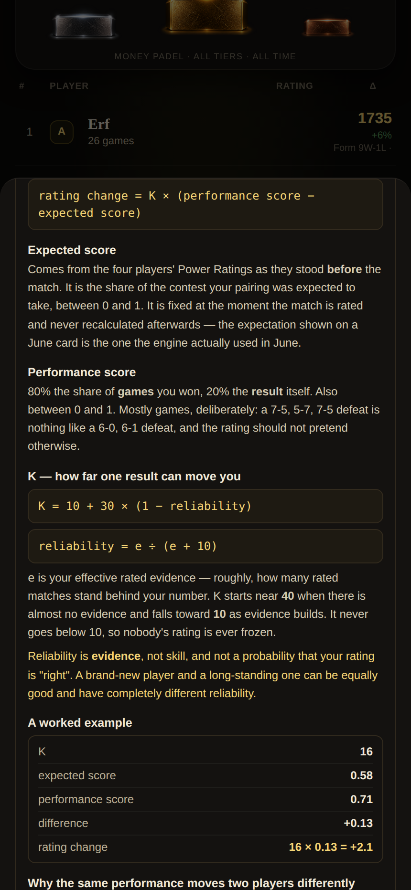

One tap away. The formulas are read from the running engine rather than written out beside it, so the guide cannot describe a model the app is not using. The comparison shows why the same overperformance moves an established player ~2.9 points and a newly reassessed one 7.4.

### Power Rating Guide — questions people actually ask

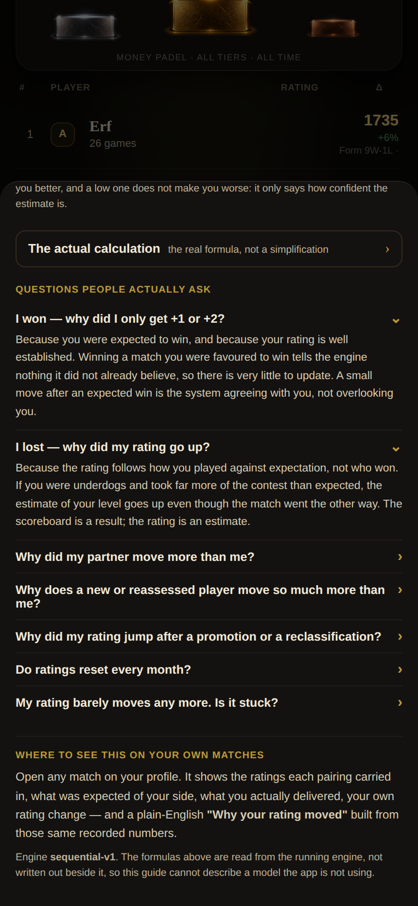

The complaints the guide exists to pre-empt, answered directly: a small move after a win, a rating rising after a loss, a partner moving further, and whether anything resets monthly.

### Why your rating moved

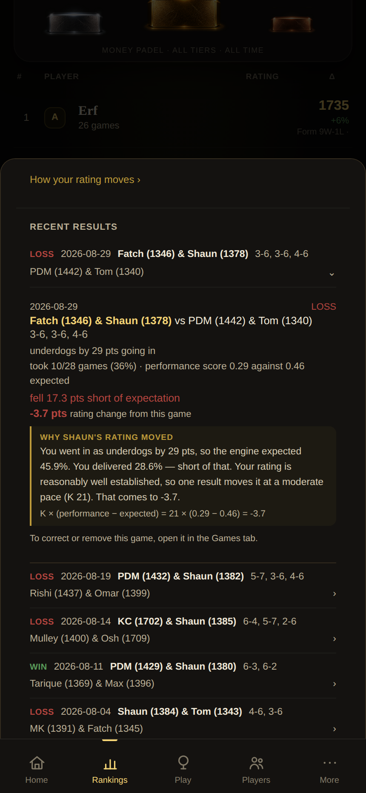

On the match card itself, built from the same persisted expectation, performance and K the movement above it came from — a reading of those facts, never a second calculation.
