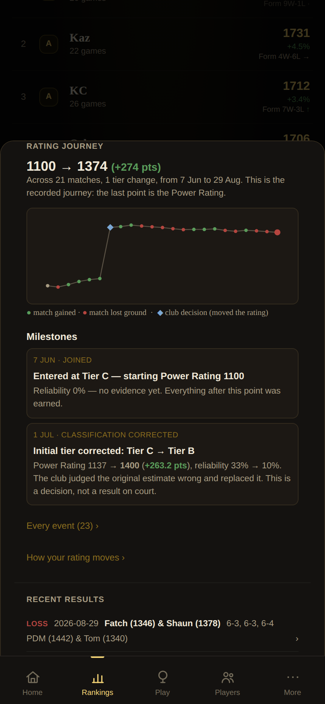
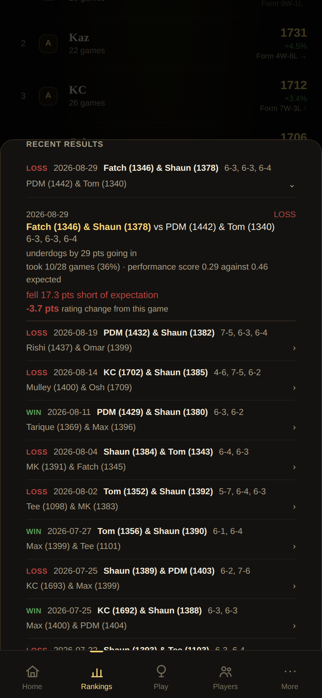
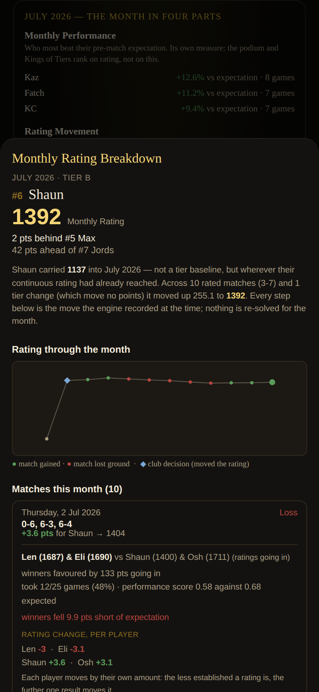
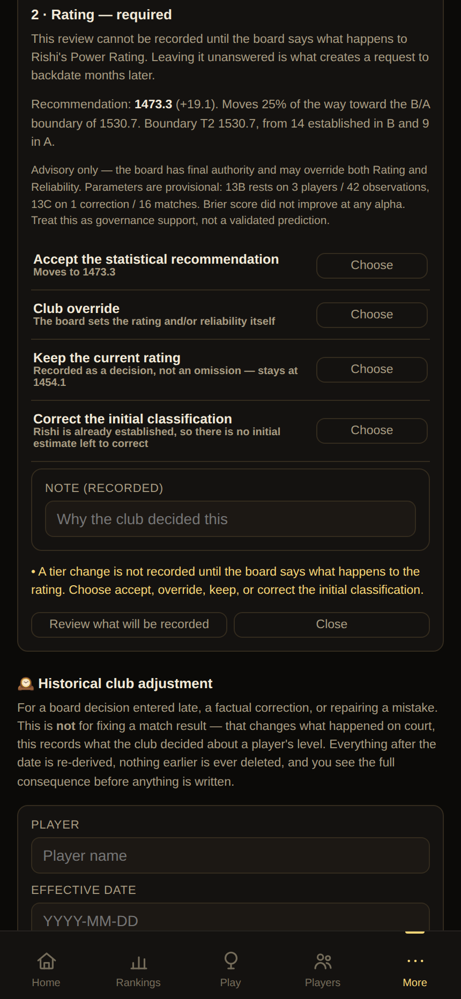
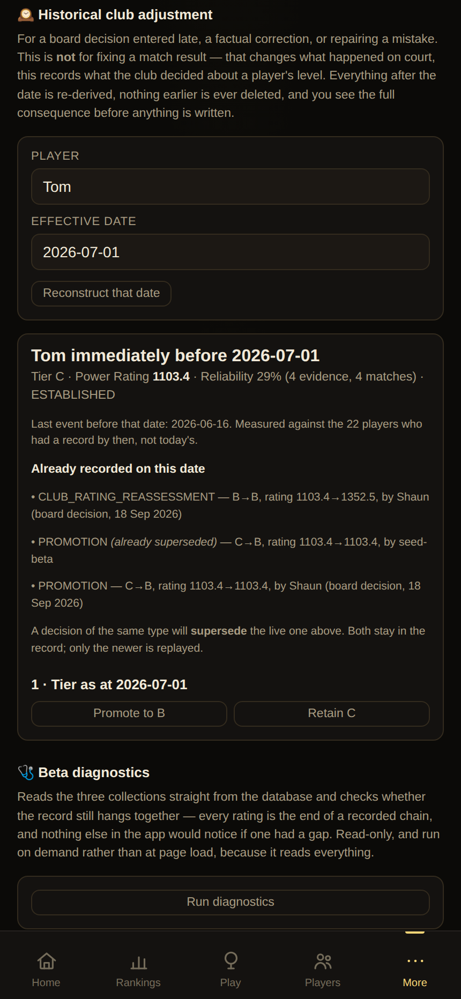
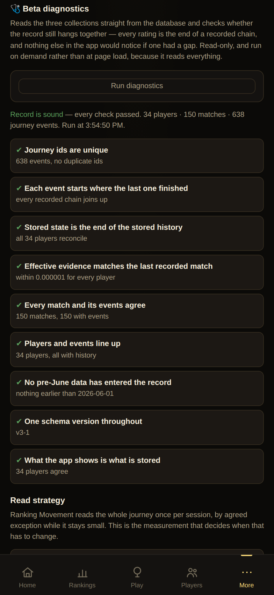
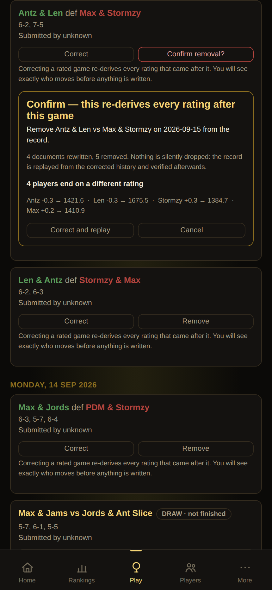
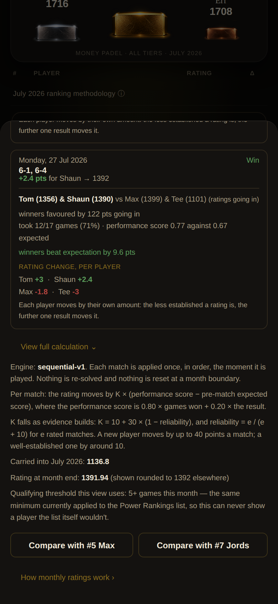

# Review screenshots

Captured 2026-09-18 from the **live beta record** by `scripts/screenshots.js`.
Review aids for CGPT and Shaun, not release documentation. Regenerate rather than edit.

Taken from the live record on purpose: the three board decisions of 18 Sep moved most of the club,
so a capture of the seeded fixture would show ratings that no longer exist.

### Power Rankings — all time

Kings of Tiers, the podium and the ranking list. A tier is crowned only where someone qualifies at the chosen minimum games, so S and C are absent here rather than shown empty.

### Power Rankings — a single month

The month in four parts. Club-decision movement is labelled separately from movement earned on court, so Tom's and Shaun's July reads as a board decision rather than form.

### Rating Journey

The recorded journey, not a reconstruction: the last point IS the Power Rating. Milestones show the club decision with its own marker.

### Match detail

Ratings as they were going in, the performance score against the pre-match expectation, and each player's own rating change.

### Monthly Rating breakdown

Carried-in rating (1137 -- wherever the continuous rating had reached, never a tier baseline) and the month's moves as the engine recorded them, including each player's own change in a shared match.

### Admin — Monthly Review

A tier change cannot be recorded until the board answers the rating question. Four explicit answers; nothing is written before confirmation.

### Admin — Historical Club Adjustment

A board decision entered late. The player's state is reconstructed as at that date, decisions already recorded on it are listed, and a new one supersedes rather than replaces — nothing earlier is deleted.

### Admin — Beta diagnostics

Reads the three collections directly and checks the record still hangs together. Also carries the read-strategy measurement.

### Games — historical match correction

Correct or remove a rated game. The blast radius is measured by replaying and shown in full before anything is written.

### The full calculation

The disclosure inside the monthly breakdown: sequential-v1 stated as it actually is -- applied once in order, never re-solved, never reset at a month boundary, with K falling as evidence builds. It also shows the unrounded month-end figure.
