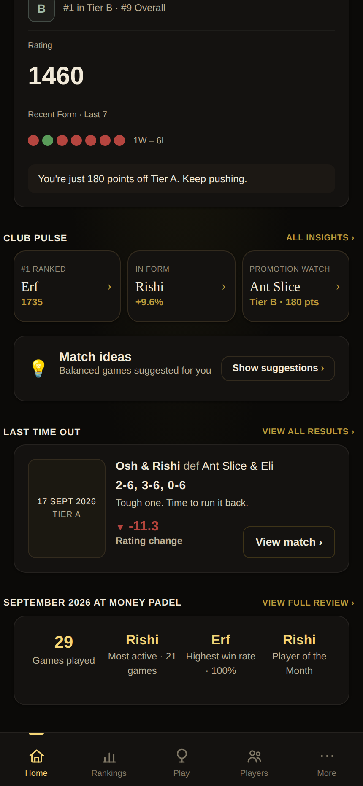
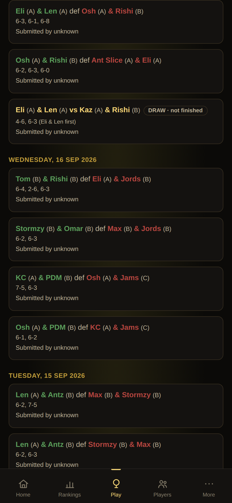
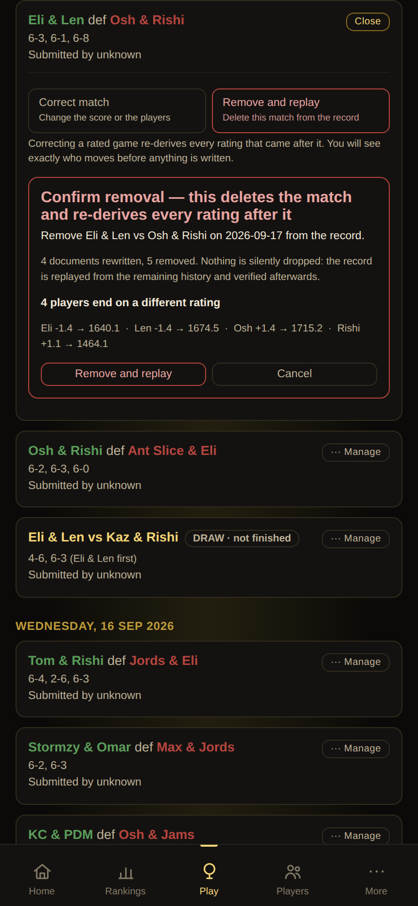
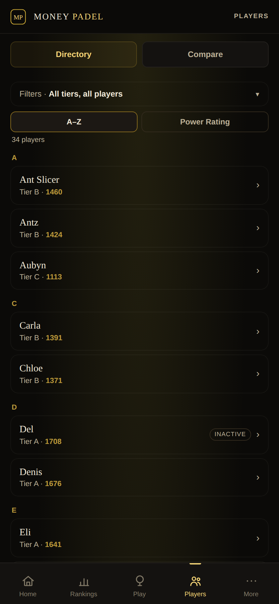
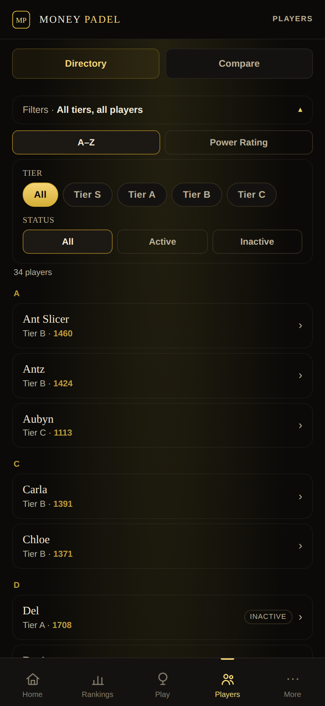
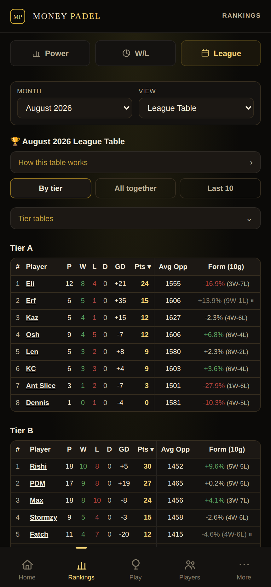
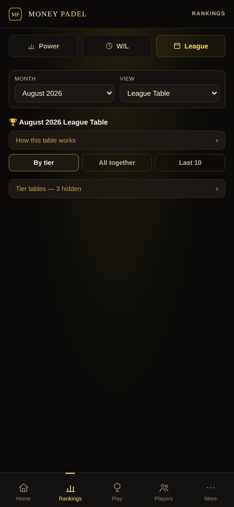
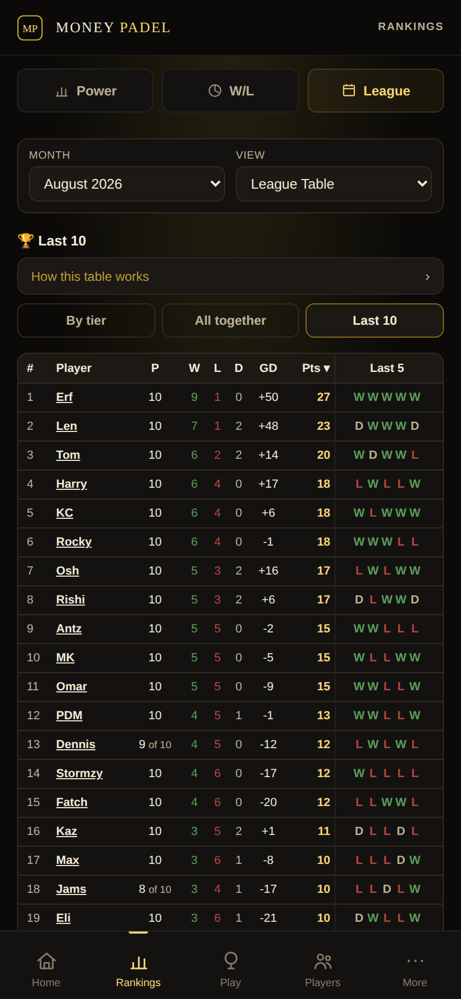
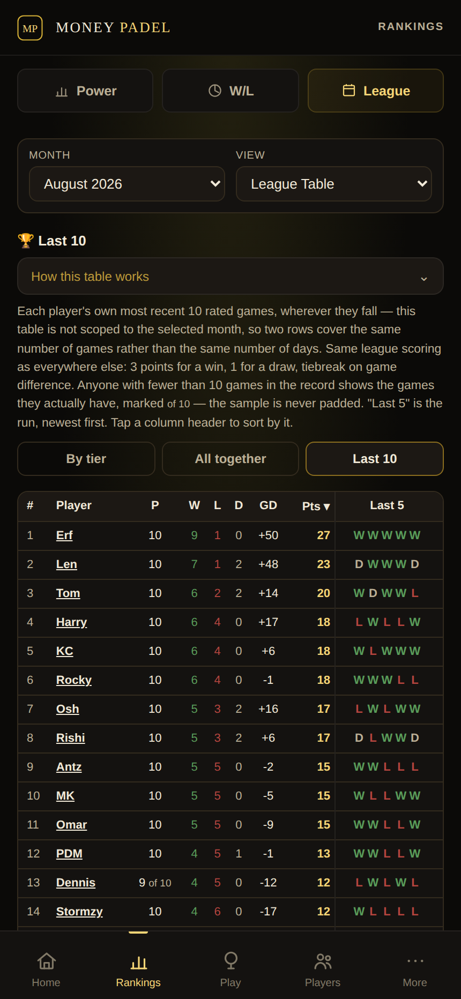

# Review screenshots

Captured from the **live beta record** as it stood on 2026-09-20, by `scripts/screenshots.js`.
Review aids for CGPT and Shaun, not release documentation. Regenerate rather than edit.

Taken from the live record on purpose: the three board decisions of 18 Sep moved most of the club,
so a capture of the seeded fixture would show ratings that no longer exist.

### Home — the lower half

Club Pulse cards open the player they name. Match ideas is collapsed until asked for. Last Time Out is built automatically from the player's own most recent rated match — result, scoreline, one deterministic line, and the rating movement the engine recorded. The monthly snapshot stays.

### Power Rankings — all time

Kings of Tiers, the podium and the ranking list. A tier is crowned only where someone qualifies at the chosen minimum games, so S and C are absent here rather than shown empty.

### Power Rankings — a single month

Key takeaways first, Monthly Performance open, the other three stories folded -- all four concepts kept. Club-decision movement stays labelled apart from movement earned on court, so Tom's July reads as a board decision rather than form.

### Player profile — reliability at a glance

Reliability sits in its own facts row with its band, beside tier and games played and deliberately away from rank and win rate: it measures how much evidence stands behind the rating, not how good the player is.

### Rating Journey

The recorded journey, not a reconstruction: the last point IS the Power Rating. Milestones show the club decision with its own marker.

### Match detail

Ratings as they were going in, the performance score against the pre-match expectation, and each player's own rating change. Scores read from the player in focus, so a loss looks like a loss.

### Monthly Rating breakdown

Carried-in rating (1137 -- wherever the continuous rating had reached, never a tier baseline) and the month's moves as the engine recorded them, including each player's own change in a shared match.

### Admin — Monthly Review

A tier change cannot be recorded until the board answers the rating question. Four explicit answers, and an answer the record makes impossible is disabled with its reason beside it rather than offered as a live button.

### Admin — Historical Club Adjustment

A board decision entered late. State reconstructed as at that date, and the decisions already on it labelled: what is Active, what was Superseded, and what each one actually did. Nothing earlier is deleted or rewritten.

### Admin — Beta diagnostics

Reads the three collections directly and checks the record still hangs together. Also carries the read-strategy measurement.

### Play — the results feed

What a player sees. Teams, result, score, badge, submission metadata — and nothing else. The correction controls exist for one person and do not appear here at all.

### Play — Manage, opened by an admin

Unlocked, one card at a time, behind a compact Manage affordance in the card header. Two separate actions with their own words: a removal is confirmed by a button that says Remove and replay, never by one that says correct. The blast radius is measured by replaying and shown in full before anything is written.

### The full calculation

The disclosure inside the monthly breakdown: sequential-v1 stated as it actually is -- applied once in order, never re-solved, never reset at a month boundary, with K falling as evidence builds. It also shows the unrounded month-end figure.

### Players — the Directory as it opens

The list is the screen. Filters are folded behind a line that says what is on ("All tiers, all players"), so the first player sits near the top instead of below half a screen of controls. A row leads with the name in the public serif, with tier and rating as quiet metadata under it; Active is the normal state and no longer shouts on every row.

### Players — the filters, opened

One tap. Tier chips wrap rather than running off the right edge of a phone, and choosing one leaves the panel open under the finger. Every filter, sort and navigation behaviour is the one that was already there.

### League — the table is the screen

Month and View side by side rather than stacked, and the explanation folded behind one line: 72px of a phone screen given back to the table. The By tier / All together choice and the split-month allocation inside the tables are untouched.

### League — tier tables collapsed

Four stacked tier tables are the longest thing on the screen. Collapsing them is presentation state only — the By tier selection and every match's tier allocation are unchanged underneath.

### Last 10 — form as a league table

Each player's own most recent ten rated games, wherever they fall. Not scoped to the selected month: every row covers the same number of games rather than the same number of days, which is what makes two rows comparable. Same 3/1/0 scoring. A short sample is marked "of 10" beside the P it qualifies and is never padded.

### Last 10 — what it is measuring

The disclosure says the thing a reader would otherwise have to assume: that the window is per player, that it ignores the month selector, and that a row with fewer than ten games is a short sample rather than a bad one.

### Power Rating Guide — in short

Reachable from More. Leads with the idea, not the formula: the rating is not a reward for wins, it is an estimate of level. The five things that sound alike are separated explicitly.

### Power Rating Guide — the actual calculation

One tap away. The formulas are read from the running engine rather than written out beside it, so the guide cannot describe a model the app is not using. The comparison shows why the same overperformance moves an established player ~2.9 points and a newly reassessed one 7.4.

### Power Rating Guide — questions people actually ask

The complaints the guide exists to pre-empt, answered directly: a small move after a win, a rating rising after a loss, a partner moving further, and whether anything resets monthly.

### Why your rating moved

Padel language first, in the order a player thinks in: were we favoured, what were we expected to take, what did we take and did we win, so what did that earn. The decimals sit behind "See full calculation" — read from the same persisted facts, never a second calculation.
